# Arkham Horror RPG Dice

Arkham Horror RPG Dice enhances Dice So Nice for the Arkham Horror RPG system. It gives normal and horror dice distinct, configurable appearances and adds dramatic visual effects for successes, failures, and psychological trauma.

<p align="center">
	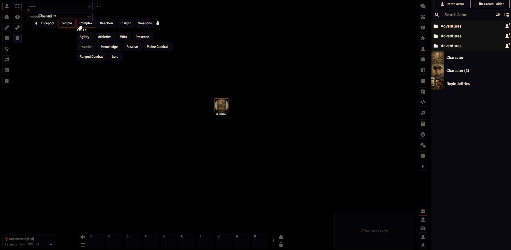
</p>

The module changes only the presentation of a roll. It does not alter dice results, chat messages, actors, or game rules.

## What it adds

- Distinguishes the system's normal and horror d6 pools during 3D rolls.
- Registers customizable `Arkham Normal Die` and `Arkham Horror Die` roles in Dice So Nice.
- Organizes palettes into three families: four Investigator palettes, nine Archetype palettes, and four Horror palettes.
- Adds success, failure, and horror-die psychological trauma special-effect modes.
- Uses CSS-generated occult effects, so there are no external art or audio assets to load.

## Dice styles

Choose from 17 palettes organized into Investigator, Archetype, and Horror collections. Normal and horror dice are registered as separate Dice So Nice roles, so each can keep a distinct appearance during Arkham rolls.

### Investigator palettes

<table>
	<tr>
		<td align="center" width="25%">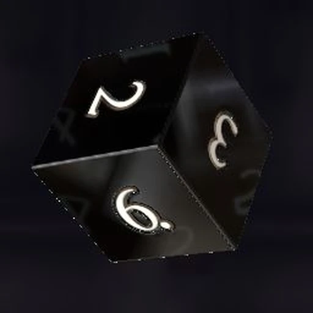<br><strong>Standard Black</strong><br><em>Default</em></td>
		<td align="center" width="25%">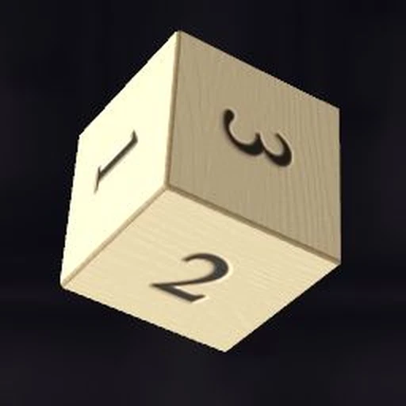<br><strong>Aged Ivory</strong></td>
		<td align="center" width="25%">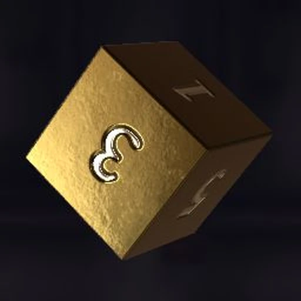<br><strong>Antique Brass</strong></td>
		<td align="center" width="25%">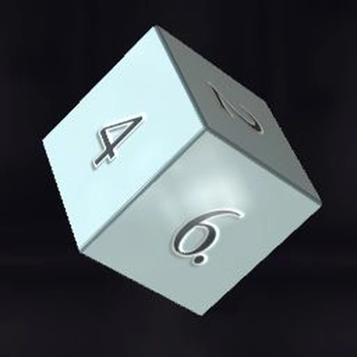<br><strong>Porcelain Blue</strong></td>
	</tr>
</table>

### Archetype palettes

<table>
	<tr>
		<td align="center" width="25%" colspan="2">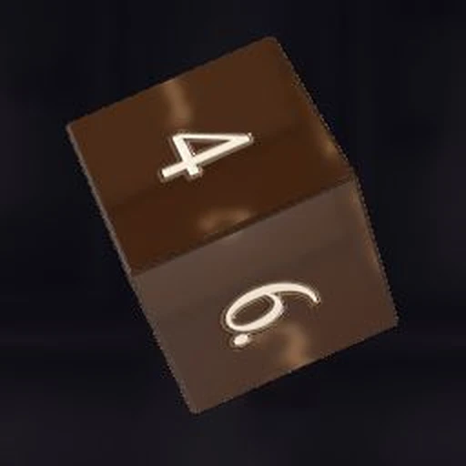<br><strong>Adventurer</strong></td>
		<td align="center" width="25%" colspan="2">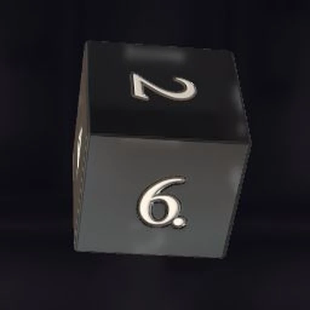<br><strong>Believer</strong></td>
		<td align="center" width="25%" colspan="2">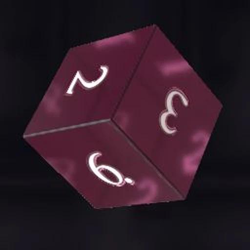<br><strong>Dreamer</strong></td>
		<td align="center" width="25%" colspan="2">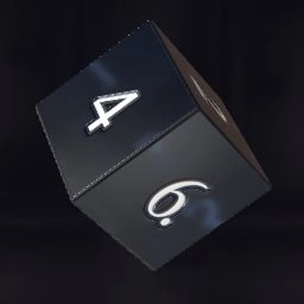<br><strong>Guardian</strong></td>
	</tr>
	<tr>
		<td align="center" width="25%" colspan="2">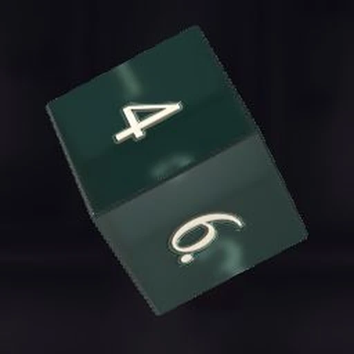<br><strong>Hunter</strong></td>
		<td align="center" width="25%" colspan="2">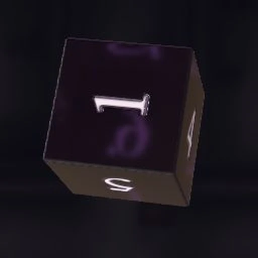<br><strong>Mystic</strong></td>
		<td align="center" width="25%" colspan="2">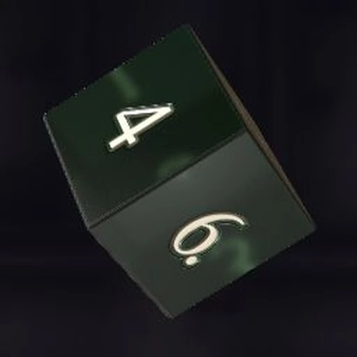<br><strong>Rogue</strong></td>
		<td align="center" width="25%" colspan="2">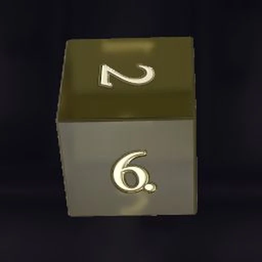<br><strong>Seeker</strong></td>
	</tr>
	<tr>
		<td colspan="3"></td>
		<td align="center" width="25%" colspan="2">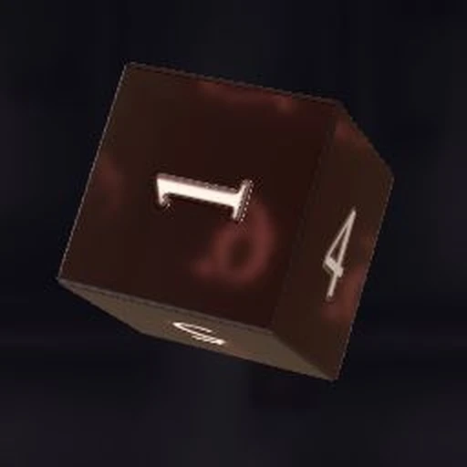<br><strong>Survivor</strong></td>
		<td colspan="3"></td>
	</tr>
</table>

### Horror palettes

<table>
	<tr>
		<td align="center" width="25%">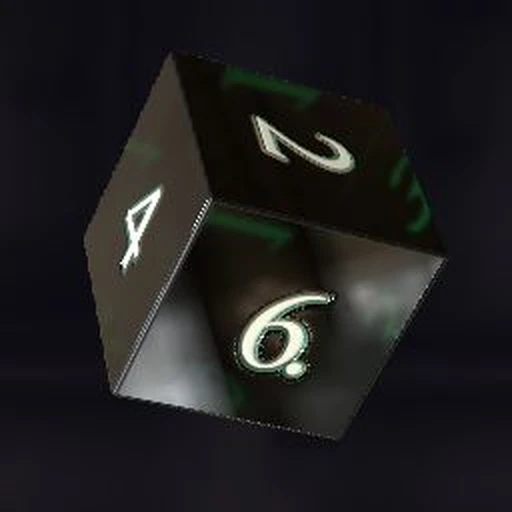<br><strong>Eldritch Green</strong><br><em>Default</em></td>
		<td align="center" width="25%">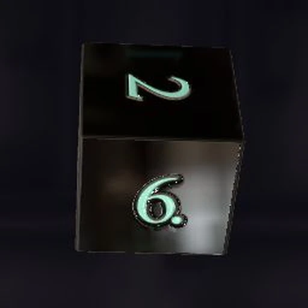<br><strong>Abyssal Black</strong></td>
		<td align="center" width="25%">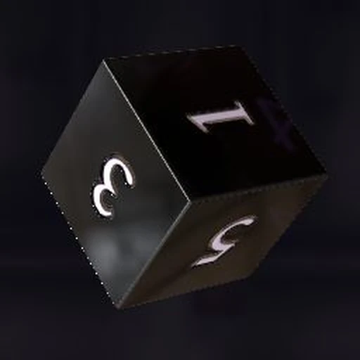<br><strong>Bruised Violet</strong></td>
		<td align="center" width="25%">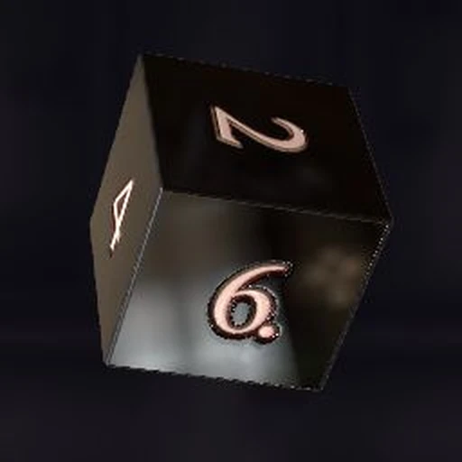<br><strong>Unnatural Crimson</strong></td>
	</tr>
</table>

## Special effects

The module adds three optional CSS-generated effects to Dice So Nice:

| Result | Special effect | Presentation |
| --- | --- | --- |
| A d6 rolls 6 | `Arkham: Seal the Omen` | A spectral-blue ward contracts shut around the die. |
| A d6 rolls 1 | `Arkham: Omen Awakens` | A crimson circle collapses into a jagged rupture. |
| An Arkham horror d6 rolls 1 | `Arkham: Mind Fractures` | A full-screen eldritch eye overwhelms the roll. |

All three effects can be active together. A horror die rolling 1 can layer `Mind Fractures` over `Omen Awakens` for a stronger result.

## Requirements

- Foundry Virtual Tabletop 14
- Arkham Horror RPG system 14.1.0 or newer
- Dice So Nice 6.3.0 or newer

## Installation

In Foundry's **Add-on Modules** setup screen, choose **Install Module**, paste this manifest URL, and select **Install**:

```text
https://github.com/Fresnoth/arkham-horror-rpg-dice/releases/latest/download/module.json
```

Enable **Arkham Horror RPG Dice** and **Dice So Nice** in the world after installation.

For a manual server installation, download `module.zip` from the latest GitHub release and extract it to `Data/modules/arkham-horror-rpg-dice`. The resulting manifest path must be `Data/modules/arkham-horror-rpg-dice/module.json`.

## Configuration

### Dice appearance

Open **Configure Settings > Module Settings > Arkham Horror RPG Dice** as the GM.

- **Color normal dice** applies the selected normal palette to Arkham normal dice. It is disabled by default so players retain their personal Dice So Nice appearance.
- **Normal dice palette** selects the world-wide normal-die appearance used when normal coloring is enabled.
- **Color horror dice** applies the horror-die role and is enabled by default.
- **Horror dice palette** selects the world-wide horror-die appearance.

The module also registers both roles in Dice So Nice's **Dice Roles** settings for deeper customization. See the official [Dice So Nice Dice Roles documentation](https://riccisi.gitlab.io/foundryvtt-dice-so-nice/guide/preferences/#dice-roles).

### Special effects

Dice So Nice controls which results trigger each effect. Open **3D Dice Settings > Special Effects** and add these three rules:

| Trigger | Mode | Special effect |
| --- | --- | --- |
| `d6 == 6` | Basic or Advanced | `Arkham: Seal the Omen` |
| `d6 == 1` | Basic or Advanced | `Arkham: Omen Awakens` |
| `d6[arkham-horror] == 1` | Advanced | `Arkham: Mind Fractures` |

For the first two rules, choose `d6` and result `6` or `1` in Basic mode. For the horror-specific rule, add a row, use the code/list toggle to switch it to Advanced mode, and enter `d6[arkham-horror] == 1`.

Select the matching Arkham effect in each row and save the main **3D Dice Settings** window. Clicking **OK** in a row's gear dialog alone does not save the overall configuration.

For trigger syntax and Dice So Nice's full SFX behavior, see the official [Dice So Nice Special Effects guide](https://riccisi.gitlab.io/foundryvtt-dice-so-nice/guide/special-effects/).

### Give every player the effects

To give every player their own copy of the configured rules, push the GM's SFX configuration:

1. Configure and save the three rules as the GM.
2. Open **3D Dice Settings > Profiles & Data**.
3. Select **Push my config to players**.
4. Select **Special effects**. Leave the other categories unchecked unless they should also be replaced.
5. Confirm **Push**.

This writes the GM's complete SFX list to every non-GM player, including disconnected players, and overwrites their previous SFX list. Dice So Nice documents this tool in its official [Profiles & Data: GM Tools guide](https://riccisi.gitlab.io/foundryvtt-dice-so-nice/guide/save-files/#gm-tools).

The per-effect **(GM Only) Enable this SFX for all players** option is not a configuration-distribution tool. It makes the GM's own matching SFX visible to other players; it does not enable or copy that rule into every player's configuration. Do not mark pushed rules as global, because players can otherwise see both their copied rule and the GM's matching effect.

## Troubleshooting

- **An effect appears only for the GM:** Enable **Show other players' special effects** for the viewing player, or use the push method.
- **An effect plays twice:** Remove the copied player rule or disable the GM rule's global option.
- **Mind Fractures never plays:** Confirm the row is in Advanced mode and uses exactly `d6[arkham-horror] == 1`.
- **The Arkham effects are missing from the selector:** Confirm both required modules are enabled, then reload the world.
- **Changes do not persist:** Save the main **3D Dice Settings** window after closing any row options dialog.

## Technical details

See [Technical Notes](docs/technical-notes.md) for how the module tags Arkham rolls, registers Dice So Nice roles and effects, and positions custom animations.